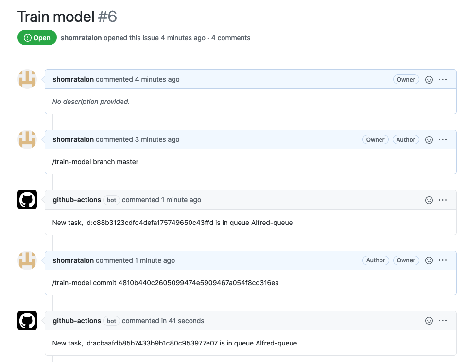

# GitHub Action For Running You Experiment With Allegro Trains


Train models easily with Allegro Trains from your repo!
 
This action helps you to run your experiments with Trains from Github directly. 
Just comment from any issue or pull request with 
  - `/train-model branch <brach name>`
  - `/train-model tag <tag_name> `
  - `/train-model commit <commit_id>`


## Usage
### Workflow Example
This will add an action to your workflow that will clone an Allegro [Task](https://allegro.ai/docs/concepts_arch/concepts_arch/#tasks)
 `TASK_ID` and will enqueue it to selected [Queue](https://allegro.ai/docs/concepts_arch/concepts_arch/#workers-and-queues) (`QUEUE_NAME` input parameter). 

Works both in github issues and github pull requests comments.



```yaml
name: Train model
on: [issue_comment]

jobs:
  train-model:
      if: contains(github.event.comment.body, '/train-model')
      runs-on: ubuntu-latest
      steps:
        - name: Train model
          uses: allegroai/trains-train-model@master
          id: train
          with:
            TRAINS_API_ACCESS_KEY: ${{ secrets.ACCESS_KEY }}
            TRAINS_API_SECRET_KEY: ${{ secrets.SECRET_KEY }}
            TRAINS_API_HOST: ${{ secrets.TRAINS_API_HOST }}
            TASK_ID: "e4623efdfa1d461e9101615728fdc52e"
            QUEUE_NAME: "train_queue"
          env:
            GITHUB_TOKEN: ${{ secrets.GITHUB_TOKEN }}
        # Example how you can use outputs from the train action
        - name: Print task status
          run: |
            echo "Task stats is ${TASK_STATUS} for task ${CLONED_TASK}"
          env:
            TASK_STATUS: ${{ steps.train.outputs.TASK_STATUS }}
            CLONED_TASK: ${{ steps.train.outputs.CLONED_TASK }}
```

### Inputs

#### Mandatory
  1. `TRAINS_API_ACCESS_KEY`: Your trains api access key. You can find it in your trains.conf file under api.credentials.access_key section, [read more](https://allegro.ai/docs/references/trains_ref/#api-section). 
  2. `TRAINS_API_SECRET_KEY`: Your trains api secret key. You can find it in your trains.conf file under api.credentials.secret_key section, [read more](https://allegro.ai/docs/references/trains_ref/#api-section).
  3. `TRAINS_API_HOST`: The Trains api server address. You can find it in your trains.conf file under  api.api_server section, [read more](https://allegro.ai/docs/references/trains_ref/#api-section).
  4. `TASK_ID`: Id of the task you would like to clone.

#### Optional

  1. `QUEUE_NAME`: Queue for the cloned task (default value: `default`). You can read more about queues [here](https://allegro.ai/docs/use_cases/trains_agent_use_case_examples/#running-workers).
  
### Outputs

1. `CLONED_TASK`: The cloned task id.
2. `TASK_STATUS`: The cloned task status (not updating).
